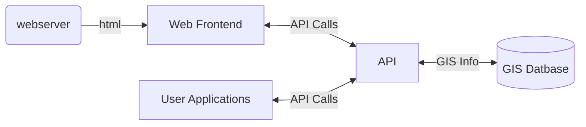
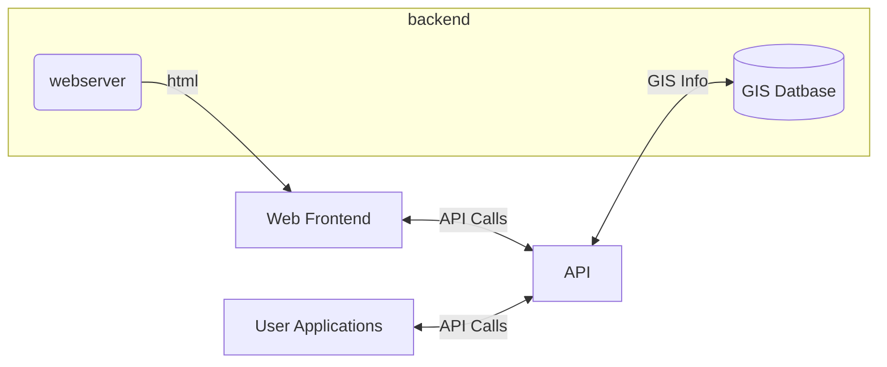

## 1st diagram

```mermaid
flowchart LR
A(webserver)-->|html|B[Web Frontend]
B<-->|API Calls|E[API]
D[User Applications]<-->|API Calls|E
E<-->|GIS Info|F[(GIS Datbase)]
```
## 2nd diagram

```mermaid
flowchart LR
A(webserver)-->|html|B[Web Frontend]
B<-->|API Calls|E[API]
D[User Applications]<-->|API Calls|E
E<-->|GIS Info|F[(GIS Datbase)]
subgraph backend
    F
    A
    end
```