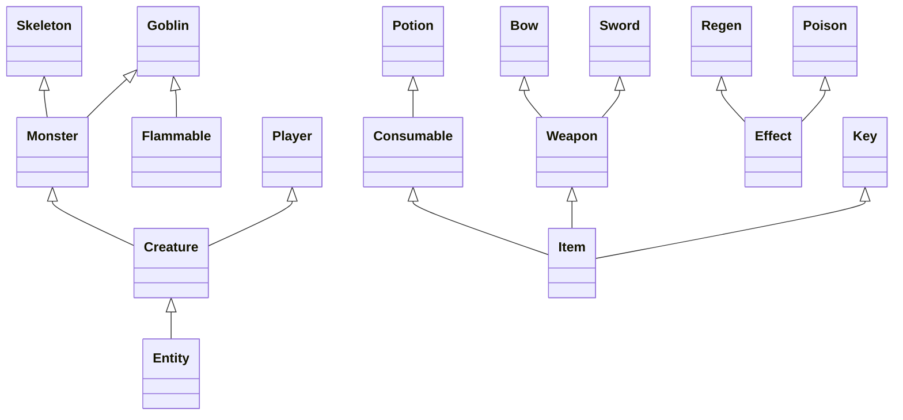

```mermaid
classDiagram
Skeleton
Goblin
Monster
Player
Creature
Entity
Potion
Consumable
Bow
Sword
Weapon
Key
Item
Regen
Poison
Effect
Lockable
Flammable
Describable
Skeleton<|--Monster
Goblin<|--Flammable
Goblin<|--Monster
Monster<|--Creature
Player<|--Creature
Creature<|--Entity
Potion<|--Consumable
Consumable<|--Item
Bow<|--Weapon
Sword<|--Weapon
Weapon<|--Item
Regen<|--Effect
Poison<|--Effect
Key<|--Item
```