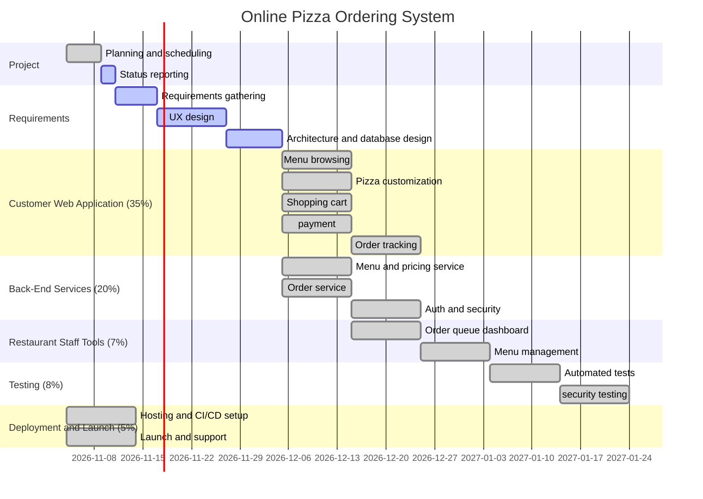

```mermaid
gantt
    title Online Pizza Ordering System
    dateFormat YYYY-MM-DD
    section Project 
        Planning and scheduling :done, research, 2026-11-04,5d
        Status reporting :active, reporting, after research, 2d
    section Requirements
        Requirements gathering :active, reqs, after reporting, 6d
        UX design :active, UX, after reqs, 10d
        Architecture and database design :active, architecture, after UX, 8d
    section Customer Web Application (35%)
        Menu browsing :done, menu, after architecture, 10d
        Pizza customization :done, pizza,  after architecture, 10d
        Shopping cart :done, cart,  after architecture, 10d
        payment :done, checkout,  after architecture, 10d
        Order tracking :done, account, after checkout, 10d
    section Back-End Services (20%)
        Menu and pricing service :done, pricing,after architecture, 10d
        Order service :done, service, after architecture, 10d
        Auth and security :done, auth, after checkout, 10d
    section Restaurant Staff Tools (7%)
        Order queue dashboard :done, queue, after checkout, 10d
        Menu management :done, management, after queue, 10d
    section Testing (8%)
        Automated tests :done, tests, after management, 10d
        security testing :done, security_tests, after tests, 10d
    section Deployment and Launch (5%)
        Hosting and CI/CD setup :done, hosting, 2026-11-04, 10d
        Launch and support :done, launch, 2026-11-04, 10d

```